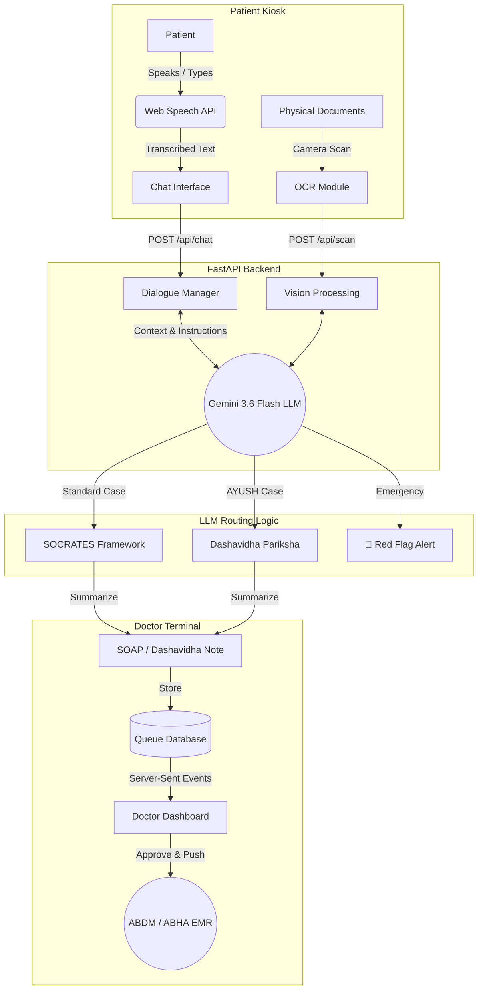

# MediKiosk — AI-Powered Clinical History & Triage Platform

**Hackathon Problem Statement:** SIH26047 (Patient Case-Taking Software)  
**Ministry:** Ministry of Ayush (All India Institute of Ayurveda)

---

## 1. The Problem Statement (SIH26047)
Indian public hospitals, especially apex institutions and AYUSH centers, face an extreme patient load with doctor-to-patient consultation times shrinking to 2–5 minutes. Within this narrow window, doctors must elicit a complex clinical history, examine prior unstructured medical documents, and form a diagnosis. 

**Key Challenges:**
1. **Time Bottleneck:** Gathering structured history (SOCRATES for Allopathy, Dashavidha Pariksha for Ayurveda) takes too long.
2. **Fragmented Records:** Patients carry disorganized paper records (prescriptions, lab reports) that take time to scan through.
3. **Low Digital Literacy:** Patients cannot use complex apps; they need natural, voice-driven interfaces.
4. **ABDM First-Mile Gap:** No system to capture clinical history and push it to the Ayushman Bharat Digital Mission (ABDM) ecosystem *before* the consultation.

---

## 2. Our Innovative Approach

Instead of a standard form-filling app, MediKiosk is designed as an **autonomous, conversational kiosk** that acts as a digital junior doctor. 

### 🌟 Key Innovations
1. **Adaptive LLM Branching:** The AI doesn't ask a rigid list of questions. It dynamically branches. If a patient says "chest pain," it immediately probes for radiation and sweating.
2. **AYUSH-First Architecture:** Automatically detects Ayurvedic keywords and seamlessly switches from the standard allopathic SOCRATES model to the **Dashavidha Pariksha** (10-fold examination: Prakriti, Vikriti, Sara, Samhanana, etc.), specifically addressing the Ministry of Ayush's unique requirements.
3. **Zero-Latency Emergency Triage (Red Flags):** The LLM is instructed to instantly break the loop upon detecting stroke signs or severe cardiac symptoms, flashing a full-screen emergency takeover and alerting the triage nurse, bypassing the standard queue.
4. **Multimodal Document OCR:** Uses Vision-Language Models to read crumpled, handwritten prescriptions and lab reports, extracting abnormal values and compiling them into the summary.
5. **Real-time SSE Sync:** Instead of heavy database polling, the architecture uses **Server-Sent Events (SSE)** to instantly sync state between the patient kiosk and the doctor's dashboard with `<1s` latency.

---

## 3. System Architecture & Tech Stack

### Current Prototype Stack (Hackathon Ready)
* **Frontend UI:** HTML5, Vanilla JS, TailwindCSS (Lightweight, no-build setup for fast kiosk execution).
* **Voice Engine:** Browser Web Speech API (STT/TTS) for native Hindi and English recognition without API overhead.
* **Backend:** Python + FastAPI + Uvicorn (Asynchronous, high-concurrency handling).
* **AI Engine:** Google Gemini 3.6 Flash (Provides high context window, ultra-fast generation, and multimodal OCR capabilities).
* **Real-time Comms:** Server-Sent Events (SSE) via `StreamingResponse`.
* **Data Persistence:** Local JSON File-backed in-memory store (Simulating a NoSQL document store).

### Production Architecture (Future Scope)
* **Database:** PostgreSQL (Relational patient data) + Redis (Queue management & Pub/Sub for SSE).
* **Voice Engine:** Bhashini / AI4Bharat (for robust multilingual Indian dialect support).
* **Integrations:** ABDM FHIR Gateway (for real ABHA ID linking and EMR push).

---

## 4. Data Flow Diagram

---

## 5. Workflow Summary
1. **Identify:** Patient logs in with ABHA ID and consents to data capture.
2. **Converse:** Patient speaks in Hindi/English. MediKiosk asks adaptive questions.
3. **Triage:** If red flags are detected, an emergency alert is triggered.
4. **Summarize:** AI compiles a SOAP/Dashavidha note with AI Confidence Flags (highlighting vague answers).
5. **Consult:** Doctor reviews the structured summary instantly, makes edits, and pushes it to the patient's ABHA locker.
